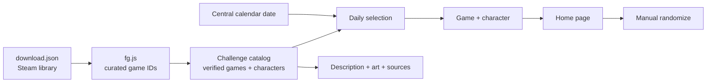

# Context

## Status

Discovery closed after 3 rounds. The implementation pack is authoritative; the local app is built and the GitHub, Vercel, and Supabase release path is in progress.

## Product

Daily Combo Trials

Build a small, server-rendered FastAPI site that gives the user a fighting-game combo-trial challenge. The site chooses a game with combo trials, chooses a character from that game, and tells the user to complete every combo trial for that character.

The site is primarily a personal FGC practice prompt. The user wants to learn how FastAPI works while making something lively and useful rather than a generic tutorial app.

## Agreed behavior

- The home page presents the current challenge.
- A challenge contains a trial game and one character.
- The daily challenge changes once per calendar day at midnight Central time.
- The home page includes a user-facing randomize button.
- The randomize button creates a temporary alternate challenge for the visitor; it does not replace the daily challenge.
- The randomizer selects a game with equal probability, then selects a character with equal probability from that game's eligible roster.
- Every character in an eligible game may be selected even when description, artwork, or other presentation metadata is incomplete.
- Missing presentation metadata must be shown as an explicit fallback rather than filled with an unsupported claim.
- Descriptions and artwork are curated into the deployable catalog at build time, with source and credit links; the first version does not scrape wikis at request time.
- Playable DLC and guest characters are included when the game provides in-game combo trials for them.
- Version 1 does not mark challenges complete, but it does keep a recommendation history on a separate route.
- The history route lists stored daily recommendations and links each date to a stable game/character page.
- The site has explicit game and character routes instead of popups, modals, or one route generated per historical date.
- Daily assignments are stored by Central-time calendar date so old recommendations remain stable when the current catalog grows.
- A character presentation should include a paraphrased one-sentence description when a trustworthy wiki or reference exists.
- The site should use official character art whenever it can be sourced appropriately.
- The target deployment platform is Vercel.
- The deployed history database is the Supabase project `elrngwxjmmjfpdedesha`, associated with the `daily-combo-trials` project name.
- The application should remain a low-complexity, pure-Python site: FastAPI routes and server-rendered templates, with basic HTML/CSS rather than a frontend framework.

## Current data inputs

- `download.json` is the exported Steam library payload.
- `fg.js` contains the current manually curated `fightingGameAppIds` list.
- `fg.js` also contains the narrower `comboTrialGameAppIds` list, currently covering 17 candidate games. This is the initial eligibility input for the challenge catalog.
- Character rosters and trial coverage still need to be modeled. The content policy is build-time curation with source and credit links.

## Provisional system model

Mermaid is the current visual fallback because an editable Figma artifact is not available in this workspace. The model should be revisited if persistence, account data, or external runtime services become part of the accepted scope.

## Ubiquitous language

- **Trial game:** A game in the curated combo-trial eligibility list.
- **Challenge:** One selected trial game and one selected character.
- **Daily challenge:** The challenge associated with the current Central-time calendar date.
- **Manual randomize:** The home-page action that creates a temporary alternate challenge without changing the daily challenge.
- **Challenge catalog:** Structured application data containing eligible games, characters, trial coverage, descriptions, artwork, and provenance.
- **Official art:** Character imagery published or authorized by the game publisher or developer, subject to a source and reuse decision.
- **Source credit:** A link or citation identifying where a description or artwork was obtained.

## Open decisions

## Implementation gates

- Add the Supabase pooled Postgres connection string to Vercel as the server-only `DATABASE_URL`; never commit it.
- Complete the catalog curation and source audit for every included game and character.
- Finalize the exact artwork fallback styling after the first rendered pass.
- Validate the temporary reroll cookie behavior across refresh and the Central-time date boundary.

## Out of scope until explicitly promoted

- Steam login or automatic Steam synchronization.
- Multi-user accounts and per-user challenge history.
- A live scraping system for every wiki.
- Full completion tracking, streaks, or social leaderboards. Recommendation history is in scope; completion history is not.
